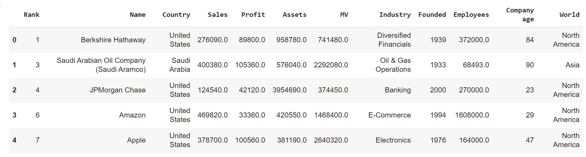

## О проекте
В нашем проекте мы будем рассматривать рейтинг 2000 самых крупных компаний с [сайта Форбс](https://www.forbes.com/consent/ketch/?toURL=https://www.forbes.com/lists/global2000/). 
Попробуем проанализировать взаимосвязь денежных показателей компаний и их качественных характеристик.

## Парсинг и обработка
Парсинг производился с помощью библиотеки BeautifulSoup. Сначала спарсили таблицу с главной страницы рейтинга, затем отдельно по каждой компании парсили еще несколько признаков. Позже, о время обработки привели количественные данные к одинаковым единицам измерения, избавились от ненужных признаков (например, имя CEO). Также добавили навые признаки, такие как "возраст компании", "часть света", "наличие акций"

## Описание получившихся данных:
Rank - место в рейтинге Forbes\
Name - название компании\
Country -страна (страна, где находится головной офис)\
Sales - выручка\
Profit - прибыль\
Assets - активы\
MV - Market Value - рыночная стоимость компании\
Industry - индустрия, сфера работы компании\
Founded - год основания\
Employees - количество работников\
Share price - цена акции или None, если акции не торгуются\
Shares availability - 1, если акции торгуются, и 0, если не торгуются\
Company age - возраст компании на 2023 год\
World - часть света, где находится Country

## Гипотезы
Рассмотрев данные, мы выдвинули следующие гипотезы:
1. Распределения Market Value в Северной Америке и в остальном мире однаковы.
2. У более старых компаний MV в среднем меньше.
3. Profit влияет на Market value больше, чем Sales.
4. В среднем MV у топ-2 индустрий одинаковый против альтернативы о неравенстве
5. MV у топ-5 индустрий в среднем такой же, как в остальных индустриях, против гипотезы о том, что в топ-5 компаниях MV больше

### В итоге будем предсказывать Market Value

## Состав группы
Капитан - Федгинкель Анастасия\
Шпеко Александра\
Рафикова Галина
